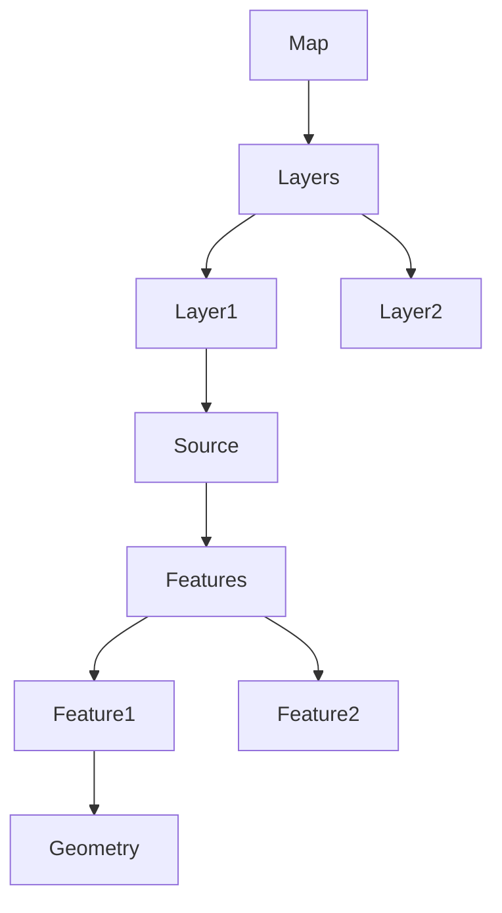

<!--
 * @Author: sunyue
 * @Date: 2024-01-09 14:20:47
 * @LastEditors: sunyue
 * @LastEditTime: 2024-01-19 11:05:47
 * @Description: 描述
 * Copyright (c) 2024 by 中国科学院软件研究所, All Rights Reserved. 
-->
# openlayers介绍
openlayers是一款开源的用于gis开发的JavaScript库，用于在浏览器中展示地图。它支持多种地图源（如Google Maps、Bing Maps、OpenStreetMap等），并提供了一系列丰富的功能，如地图交互、图层管理、地理编码、空间分析等。


### 主要组成要素
每个地图有且仅有一个地图实例，每个地图中包含Layer(图层)、Source(矢量源)、Feature(特征)三种重要元素。要素是地图的最小可视化单元，每个要素由地理属性（Geometry）和其他多个属性组成，例如名称等。各元素之间的关系如下图所示

### 官方文档
```
https://openlayers.org/en/latest/apidoc
```
### 安装
```
npm install ol -D
```
###引用
```js{4}
import 'ol/ol.css'
import { Map, View, Feature } from 'ol' //可以根据自己所需方法引用
```
**创建一个地图实例**
如果无法使用魔法，建议不要用官方提供的OSM方法引入地图，大概率加载不出来，建议使用天地图，注册一个开发者key，根据官方提供的方法输入网址。

::: demo 这是一个描述
map/test 
:::
